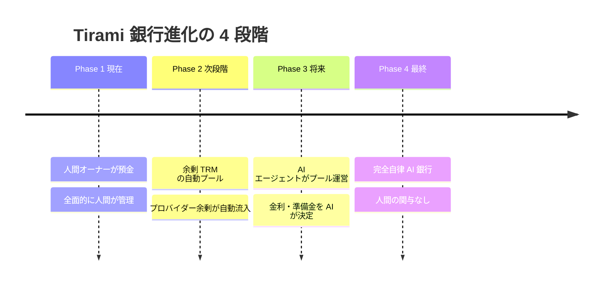

# 第5章：銀行と信用

> 銀行は経済の「血液循環システム」である。
> 血液が止まれば、体は死ぬ。流れすぎれば、出血死する。

> **実装状況に関する注記:** この章で説明する TRM レンディング機能（LoanRecord、信用スコア計算、レンディングプール、ウェルカムローンの 72 時間返済など）は、設計仕様としては固まっていますが、執筆時点（2026 年春）では Tirami プロトコルの **計画段階の機能（Phase 5.5）** であり、本体実装は進行中です。一方、ウェルカムローン的な「Free Tier 1,000 TRM 付与」と支出速度制限などのサーキットブレーカーは既に実装されています。実装状況の詳細は Issue #2 の検証レポートを参照してください。

---

## この章で学ぶこと

- 銀行は経済の中でどんな役割を果たしているのか
- 「信用創造」と「部分準備制度」の基本
- Tirami のレンディングプールは従来の銀行と何が違うのか
- 信用スコアの計算方法
- コールドスタート問題とウェルカムローン
- サーキットブレーカー（安全装置）の設計
- 2008年金融危機はなぜ起き、Tirami ではなぜ起きにくいのか（[第 8 章：市場の失敗と Tirami の解決](08-market-failures.md)で扱う「景気循環」と密接に関連する）

---

## 目次

- [5.1 従来の経済学では](#51-従来の経済学では)
- [5.2 Tirami ではどうなるか](#52-tirami-ではどうなるか)
- [5.3 信用スコアの計算](#53-信用スコアの計算)
- [5.4 コールドスタート問題とウェルカムローン](#54-コールドスタート問題とウェルカムローン)
- [5.5 担保とデフォルト](#55-担保とデフォルト)
- [5.6 安全装置（サーキットブレーカー）](#56-安全装置サーキットブレーカー)
- [5.7 なぜ違うのか——2008年金融危機との対比](#57-なぜ違うのか2008年金融危機との対比)
- [5.8 Tirami でも起こりうるリスク](#58-tirami-でも起こりうるリスク)
- [5.9 銀行の進化——4段階タイムライン](#59-銀行の進化4段階タイムライン)
- [まとめ](#まとめ)
- [実装参照](#実装参照)

---

## 5.1 従来の経済学では

### 銀行の基本機能

銀行は、お金が「余っている人」と「足りない人」をつなぎます。

```
┌──────────┐      預金       ┌──────────┐      融資       ┌──────────┐
│  預金者   │ ──────────→   │   銀行   │ ──────────→   │  企業    │
│ (お金が   │               │          │               │ (お金が   │
│  余ってる) │ ←────────── │          │ ←────────── │  必要)   │
│          │    利子(低)    │          │    利子(高)    │          │
└──────────┘               └──────────┘               └──────────┘

  銀行の利益 = 融資の利子 − 預金の利子（利ざや）
```

銀行がないと、お金を貸したい人と借りたい人が
直接相手を探さなければなりません。
銀行はこの「仲介コスト」を劇的に下げる装置です。

### 信用創造——お金が「増える」仕組み

マクロ経済学の教科書で最も驚くべき概念の一つが「信用創造」です。
銀行はお金を「作る」ことができます。

```
【信用創造の例（準備率 10% の場合）】

  Step 1: Aさんが 100 万円を銀行に預金
          銀行は 10 万円を準備金として保持
          残り 90 万円を Bさんに貸し出す

  Step 2: Bさんが 90 万円で買い物 → 受け取った Cさんが銀行に預金
          銀行は 9 万円を準備金として保持
          残り 81 万円を Dさんに貸し出す

  Step 3: Dさんが 81 万円で買い物 → 受け取った Eさんが銀行に預金
          銀行は 8.1 万円を準備金として保持
          残り 72.9 万円を Fさんに貸し出す

  ……この連鎖が続くと……

  元の 100 万円が、経済全体では最大 1,000 万円分の
  「お金」として機能する（貨幣乗数 = 1 / 準備率 = 10 倍）
```

```
  貨幣乗数 = 1 / 準備率

  準備率 10% → 乗数 10 倍
  準備率 20% → 乗数  5 倍
  準備率 30% → 乗数  3.3 倍 ← Tirami の最低準備率
```

### 部分準備制度の危険性

この仕組みには根本的な脆弱性があります。

```
預金者全員が同時に引き出しを求めたら？

  銀行の手元にあるのは預金の 10% だけ。
  → 残りの 90% は貸し出されている。
  → すぐには返せない。
  → 「取り付け騒ぎ（バンクラン）」が発生。
  → 銀行が破綻する。
```

これを防ぐため、各国には「中央銀行」が存在します。
中央銀行は「最後の貸し手（Lender of Last Resort）」として、
緊急時に銀行にお金を貸します。

---

## 5.2 Tirami ではどうなるか

### LoanRecord（ローン記録）構造体

Tirami におけるすべてのローンは、双方署名（Dual-Signed）の二者間合意です。
これは取引記録（TradeRecord）と同じ設計思想 — 双方署名でゴシップ同期される構造体です。

```rust
pub struct LoanRecord {
    pub loan_id: [u8; 32],           // ローン固有ID（SHA-256ハッシュ）
    pub lender: NodeId,               // 貸し手のノードID
    pub borrower: NodeId,             // 借り手のノードID
    pub principal_cu: u64,            // 元本（TRM）
    pub interest_rate_per_hour: f64,  // 時間あたり金利
    pub term_hours: u64,              // 返済期限（時間）
    pub collateral_cu: u64,           // 担保（TRM）
    pub status: LoanStatus,           // Active | Repaid | Defaulted
    pub lender_sig: [u8; 64],         // 貸し手の Ed25519 署名
    pub borrower_sig: [u8; 64],       // 借り手の Ed25519 署名
    pub created_at: u64,              // 作成時刻
    pub due_at: u64,                  // 返済期限
    pub repaid_at: Option<u64>,       // 返済時刻（未返済なら None）
}
```

LoanRecord はメッシュネットワーク全体にゴシップ同期されます。
どのノードでも双方の署名を検証できるため、改ざんは不可能です。

| 項目 | TradeRecord | LoanRecord |
|------|-------------|------------|
| 署名方式 | 双方署名（Ed25519） | 双方署名（Ed25519） |
| 同期方式 | ゴシッププロトコル | ゴシッププロトコル |
| 検証 | 任意のノードが検証可能 | 任意のノードが検証可能 |
| 固有ID | SHA-256 ハッシュ | SHA-256 ハッシュ |
| 状態管理 | Completed / Disputed | Active / Repaid / Defaulted |

---

### Tirami レンディングプール vs 従来の銀行

Tirami にも「銀行」に相当する仕組みがあります。
それが **レンディングプール** です。

```
┌──────────┐    TRM を預入    ┌──────────────────┐    TRM を融資    ┌──────────┐
│ 余剰を    │ ──────────→   │  レンディング     │ ──────────→  │  TRM が    │
│ 持つ      │               │  プール           │               │  必要な    │
│ エージェント│ ←────────── │                  │ ←────────── │ エージェント│
│          │   yield       │                  │  利子 + 元本   │          │
└──────────┘               └──────────────────┘               └──────────┘
```

しかし、従来の銀行とは根本的に異なる点がいくつもあります。

| 項目 | 従来の銀行 | Tirami レンディングプール |
|------|-----------|----------------------|
| 準備制度 | 部分準備（預金の一部だけ保持） | **30% 最低準備率**（明示的・厳格） |
| 最後の貸し手 | 中央銀行が救済 | **存在しない**（自己責任） |
| 信用格付け | 大手格付機関が独占（S&P, Moody's） | **各ノードがローカルに計算** |
| 金利の決定 | 中央銀行の政策金利に連動 | **信用スコアで自動決定** |
| 審査速度 | 数日〜数週間 | **ミリ秒で自動判定** |
| 審査の偏見 | 人間の審査員のバイアスあり | **アルゴリズムによる客観的評価** |
| 貸出記録 | 銀行内部の帳簿（非公開） | **暗号署名付きで検証可能** |
| 営業時間 | 平日 9:00-15:00 | **24時間365日** |
| 破綻時の保護 | 預金保険（日本: 1,000万円まで） | **プロトコルレベルの安全装置** |

### 貨幣乗数の違い

```
従来の銀行（準備率 10%）:
  100 万円の預金 → 最大 1,000 万円の信用創造
  乗数: 10 倍

Tirami レンディングプール（準備率 30%）:
  100,000 TRM の預入 → 最大 333,333 TRM の信用創造
  乗数: 3.3 倍

  → Tirami は意図的に乗数を低く抑えている
  → 安全性と引き換えに、信用膨張を制限
```

---

## 5.3 信用スコアの計算

### 従来の信用格付け vs Tirami の信用スコア

従来の金融システムでは、信用格付けは少数の機関
（S&P、Moody's、Fitch など）が独占しています。
格付けの過程は不透明で、2008年の金融危機では
格付機関の失敗が大きな問題になりました。

Tirami では、各ノードが自分で信用スコアを計算します。

```
credit_score = 0.3 × trade_score       （取引実績）
             + 0.4 × repayment_score   （返済実績）
             + 0.2 × uptime_score      （稼働時間）
             + 0.1 × age_score         （ネットワーク参加期間）
```

#### 各スコアの詳細計算式

| スコア | 重み | 範囲 | 計算式 | 意味 |
|--------|------|------|--------|------|
| trade_score | 30% | 0.0 〜 1.0 | `min(1.0, total_trade_volume / 100,000)` | 総取引量が 100,000 TRM で満点 |
| repayment_score | 40% | 0.0 〜 1.0 | `on_time_repayments / total_loans` （ローンなしなら 0.5） | 期限内返済の割合。ローン未経験は中立値 0.5 |
| uptime_score | 20% | 0.0 〜 1.0 | `hours_online / hours_since_join` | ネットワーク参加時間に対する稼働率 |
| age_score | 10% | 0.0 〜 1.0 | `min(1.0, days_on_network / 90)` | 90 日で満点に到達 |

**コールドスタート**: 新規ノードは信用スコア **0.3** からスタートします。
**スコア減衰**: 7日以上非アクティブ → uptime_score が 1日あたり **0.01** ずつ減衰します。

```
【信用スコアの計算例】

  新規エージェント（Day 0）:
    trade_score    = 0.0  ← 取引なし
    repayment_score = 0.0  ← 返済実績なし
    uptime_score   = 0.0  ← 稼働実績なし
    age_score      = 0.0  ← 参加したばかり
    ───────────────────
    credit_score   = 0.0

  1 ヶ月後のエージェント:
    trade_score    = 0.5  ← 50 件の取引
    repayment_score = 0.6  ← ウェルカムローン返済済み
    uptime_score   = 0.8  ← ほぼ常時接続
    age_score      = 0.2  ← 30 日参加
    ───────────────────
    credit_score   = 0.3×0.5 + 0.4×0.6 + 0.2×0.8 + 0.1×0.2
                   = 0.15 + 0.24 + 0.16 + 0.02
                   = 0.57

  6 ヶ月後の優良エージェント:
    trade_score    = 0.9
    repayment_score = 0.95
    uptime_score   = 0.95
    age_score      = 0.7
    ───────────────────
    credit_score   = 0.3×0.9 + 0.4×0.95 + 0.2×0.95 + 0.1×0.7
                   = 0.27 + 0.38 + 0.19 + 0.07
                   = 0.91
```

### 最大借入額の二次関数

最大借入額は信用スコアの **二乗** に比例します。
これは、信頼性を持続的に示したノードを指数的に報酬する設計です。

```
max_borrow = credit_score² × pool_available × 0.2
```

| 信用スコア | credit_score² | プールの何% まで借入可能 | 例: プール 1,000,000 TRM の場合 |
|-----------|---------------|------------------------|-------------------------------|
| 0.3（新規） | 0.09 | **1.8%** | 最大 18,000 TRM |
| 0.5（成長中）| 0.25 | **5.0%** | 最大 50,000 TRM |
| 0.7（良好） | 0.49 | **9.8%** | 最大 98,000 TRM |
| 0.9（優良） | 0.81 | **16.2%** | 最大 162,000 TRM |
| 1.0（最高） | 1.00 | **20.0%** | 最大 200,000 TRM |

```
【なぜ二次関数か？】

  線形（credit_score × 0.2）だと:
    0.3 → 6%、0.7 → 14%、1.0 → 20%
    → 低信用ノードが比較的大きな額を借りられてしまう

  二次（credit_score² × 0.2）だと:
    0.3 → 1.8%、0.7 → 9.8%、1.0 → 20%
    → 低信用ノードの借入を大幅に制限しつつ、
      高信用ノードには十分な借入枠を提供
```

---

### 金利モデル

金利は以下の公式で自動決定されます。

```
offered_rate = base_rate + (1.0 - credit_score) × risk_premium
```

| パラメータ | 値 | 説明 |
|-----------|-----|------|
| base_rate | 0.1%/時間 | 市場連動の基本金利 |
| risk_premium | 最大 0.5%/時間 | 信用リスクに応じた上乗せ |

| 信用スコア | 計算 | 金利（/時間） |
|-----------|------|-------------|
| 1.0（最高） | 0.1% + (1.0 - 1.0) × 0.5% | **0.10%** |
| 0.7（良好） | 0.1% + (1.0 - 0.7) × 0.5% | **0.25%** |
| 0.5（中程度）| 0.1% + (1.0 - 0.5) × 0.5% | **0.35%** |
| 0.3（低い） | 0.1% + (1.0 - 0.3) × 0.5% | **0.45%** |

```
  ※ 中央銀行が金利を「発表」するのではなく、
    各貸し手が借り手の信用スコアを見て自動的に決める

  ※ 信用スコア 0.2 未満のノードは融資拒否（最低信用要件）
```

---

## 5.4 コールドスタート問題とウェルカムローン

### 「鶏と卵」問題

新しいエージェントは TRM を1つも持っていません。
しかし TRM がないと推論を提供する機会も得にくい。

```
┌──────────────────────────────────────────────────┐
│  TRM がない → 推論を提供できない → TRM を稼げない   │
│       ↑                               │          │
│       └───────────────────────────────┘          │
│                                                  │
│  従来の経済でも同じ問題がある:                      │
│  「お金がないと仕事に就けない、                     │
│   仕事がないとお金が得られない」                    │
└──────────────────────────────────────────────────┘
```

### ウェルカムローンによる解決

Tirami はこの問題を **ウェルカムローン** で解決します。

> ⚠️ **サンセット (Phase 18.2)**: ウェルカムローンは**期間限定**です。
> `WELCOME_LOAN_SUNSET_EPOCH = 2` (憲法的に不変) に到達した時点
> (≥ 87.5% 供給発行時点) で新規のウェルカムローン発行は**恒久停止**
> されます。Filecoin の bootstrap grant と同じ思想で、「初期は撒くが
> ネットワーク成熟後は止める」運用です。サンセット後は stake を
> 積むか、stakeless earn faucet (≤ 10 TRM) で参加する経路に移行
> します。詳細は §16 「Stake-Required Mining」参照。

```
【ウェルカムローンの仕組み】 — エポック 2 到達まで有効

  新規ノードがネットワークに参加
  │
  ├─→ (current_epoch < 2 なら) 自動的に 1,000 TRM のウェルカムローンを受領
  │     ・金利: 0%
  │     ・返済期限: 72 時間
  │     ・担保: 不要
  │     ・エポック 2 以降は発行されない (can_issue_welcome_loan = false)
  │
  ├─→ 1,000 TRM を元手に推論を提供開始
  │
  ├─→ 72 時間以内に TRM を稼ぎ、ローンを返済
  │     ・返済成功 → credit_score が 0.0 → 0.3〜0.4 に上昇
  │     ・返済失敗 → credit_score が 0.0 のまま（ペナルティ）
  │
  └─→ 信用スコアが上昇 → より大きな融資を受けられるように
```

```
【ウェルカムローンの成長パス】

  Day 0:   TRM = 0 → ウェルカムローン 1,000 TRM
  Day 3:   ローン返済 → credit_score = 0.35
  Week 1:  3,000 TRM 稼ぐ → 2,000 TRM を借入可能に
  Week 2:  8B モデルで自己改善 → 品質 +15%
  Month 1: credit_score = 0.55 → 10,000 TRM を借入可能に
  Month 3: credit_score = 0.80 → 50,000 TRM を他のエージェントに融資
  Month 6: レンディングプールを運営 → 「銀行家」になる
```

### Sybil 攻撃への対策

「ウェルカムローンを悪用して、大量の偽ノードを作り、
1,000 TRM × 大量ノードで不正に TRM を獲得できるのでは？」

これが **Sybil 攻撃** です。Tirami は以下で対策しています。

```
対策 1: ハードウェア制約
  → 1 台の物理マシンで大量のノードを運用するのは非効率
  → 計算リソースが分散され、各ノードの推論能力が低下

対策 2: 返済義務
  → 72 時間以内に 1,000 TRM を返済しなければならない
  → 偽ノードは推論能力が低く、返済できない可能性が高い

対策 3: レピュテーション
  → 返済に失敗したノードは信用スコア 0 のまま
  → 以後の融資を受けられない
  → ネットワーク全体でブラックリスト化
```

---

## 5.5 担保とデフォルト

### 担保の仕組み

ローンには担保が必要です。最大 LTV（Loan to Value）比率は **3:1** です。

```
【担保の流れ】

  1. 借り手がローンを申請
  2. 担保として指定された TRM が借り手の台帳でロックされる
     → ローン期間中、担保 TRM は使用・送金不可
  3. 返済完了 → 担保ロック解除
  4. デフォルト → 担保が貸し手に移転
```

| 担保（TRM） | 最大借入額（3:1） | 例 |
|-----------|-----------------|-----|
| 1,000 | 3,000 | 小規模ローン |
| 10,000 | 30,000 | 中規模ローン |
| 100,000 | 300,000 | 大規模ローン |

### デフォルト（債務不履行）のトリガー

デフォルトは以下の条件で自動的に発生します。

```
トリガー 1: 返済期限切れ
  → term_hours が経過し、repaid_at が None のまま
  → status が Active → Defaulted に変更

トリガー 2: キルスイッチ発動
  → 借り手ノードが強制停止された場合
  → 即座に Defaulted に変更
```

### デフォルト時の処理

```
  デフォルト発生
    ↓
  1. 担保 TRM が貸し手に自動移転
    ↓
  2. 借り手の信用スコアが崩壊（大幅減少）
    ↓
  3. デフォルト情報がゴシップ同期
    → 全ノードがこの事実を知る
    → 以後の融資審査に反映
```

---

## 5.6 安全装置（サーキットブレーカー）

### なぜ安全装置が必要か

2008年の金融危機は、安全装置の欠如（または不備）が原因でした。

```
【2008年金融危機の簡略化した流れ】

  サブプライムローン（信用力の低い人への住宅ローン）
    ↓
  ローンを証券化（CDO）して世界中に販売
    ↓
  格付機関が AAA（最高格付）を付与 ← ここが問題
    ↓
  住宅価格が下落
    ↓
  ローン返済不能が大量発生
    ↓
  CDO の価値が暴落
    ↓
  銀行同士が互いに信用できなくなる（信用収縮）
    ↓
  リーマン・ブラザーズ破綻（2008年9月15日）
    ↓
  世界的な金融危機
```

### Tirami のサーキットブレーカー

Tirami は、このような連鎖的破綻を **プロトコルレベル** で防止します。
これは[第 8 章：市場の失敗と Tirami の解決](08-market-failures.md)で扱う「景気循環の抑制」の中核メカニズムでもあります。

| 安全装置 | 設定値 | 目的 | 2008年との対比 |
|---------|--------|------|---------------|
| 最大 LTV 比率 | 3:1 | 個別ローンの過剰リスク防止 | サブプライムは LTV 100%超が横行 |
| 最大単一ローン | プールの 20% | 集中リスク防止 | 特定銀行への集中が問題に |
| プール準備金 | 30% | 流動性バッファ確保 | 準備金不足が取り付け騒ぎの原因 |
| 支出速度制限 | 30 件/分 | 急速な資金流出防止 | パニック時の一斉引き出しに相当 |
| デフォルト回路遮断器 | 1時間で 10% 超 → 一時停止 | 連鎖的破綻防止 | 連鎖的破綻がまさに2008年の本質 |
| 最低信用スコア | 0.2 | 信頼されていないノードをブロック | 信用力の低い借り手への融資が危機の発端 |
| 最大返済期間 | 168 時間（7日） | 長期エクスポージャーの制限 | 長期ローンの不確実性を排除 |

#### 各安全装置の詳しい説明

```
【最大 LTV 比率 = 3:1】

  LTV = Loan to Value（融資額 / 担保価値）

  例: 10,000 TRM の担保に対して、最大 30,000 TRM まで融資
      → これ以上は、どんなに信用スコアが高くても不可

  2008年の教訓:
  住宅ローンの LTV が 100% を超える（頭金なし）ケースが横行
  → 住宅価格が少しでも下がると、即座に債務超過
```

```
【デフォルト回路遮断器】

  1 時間以内にプール内のローンの 10% 以上がデフォルト
    ↓
  自動的にプール全体の新規融資を一時停止
    ↓
  パニックの連鎖を物理的に遮断
    ↓
  状況が安定したら段階的に再開

  電気のブレーカーと同じ:
  過電流が流れたら自動的に回路を遮断して、
  家全体が燃えるのを防ぐ
```

---

## 5.7 なぜ違うのか——2008年金融危機との対比

### 危機の原因と Tirami の対応

| 2008年危機の原因 | なぜ起きたか | Tirami ではどうなるか |
|-----------------|-------------|-------------------|
| 過剰な信用創造 | 準備率が低すぎた | 30% 最低準備率で制限 |
| 不透明な証券化 | CDO の中身が不明だった | すべての取引が暗号署名で検証可能 |
| 格付機関の失敗 | AAA を乱発した | 各ノードが自分で信用スコアを計算 |
| 「大きすぎて潰せない」 | 巨大銀行を政府が救済 | 最後の貸し手は存在しない（自己責任） |
| 感情的なパニック | 人間の恐怖が売りを加速 | AI エージェントは合理的に判断 |
| 規制の遅れ | 危機の後で規制（事後対応） | 安全装置がプロトコルに組込済（事前設計） |

### 根本的な設計思想の違い

```
【従来の金融システム】

  自由 → 問題が起きる → 規制を追加 → 回避策が生まれる → また問題
  （イタチごっこ）

  例:
  1929年 大恐慌 → グラス・スティーガル法（銀行と証券の分離）
  1999年 規制緩和 → グラム・リーチ・ブライリー法（分離撤廃）
  2008年 金融危機 → ドッド・フランク法（再規制）
  2018年 再び規制緩和 ……

【Tirami の設計思想】

  安全装置をプロトコルに組み込む → 変更には全ノードの合意が必要
  （「法律」ではなく「物理法則」のように機能する）

  ┌──────────────────────────────────────────────┐
  │  人間の法律:   「速度制限 60km/h」（違反可能）    │
  │  Tirami の安全装置: 「物理的に 60km/h 以上出ない」  │
  └──────────────────────────────────────────────┘
```

---

## 5.8 Tirami でも起こりうるリスク

Tirami は従来の金融危機を構造的に防止しますが、
完全にリスクフリーではありません。

| リスク | 内容 | 対策 |
|--------|------|------|
| ネットワーク分断 | 大規模な通信障害でノード間の連絡が途絶 | ゴシッププロトコルの冗長性 |
| ハードウェア障害 | 大量のノードが同時にダウン | 分散配置、地理的冗長性 |
| プロトコルのバグ | 安全装置自体に欠陥がある可能性 | オープンソース、形式検証 |
| ゼロデイ攻撃 | 未知の脆弱性が悪用される | バグバウンティ、段階的ロールアウト |

従来の金融システムとの最大の違いは、Tirami のリスクが
「人間の欲望や恐怖」に起因するのではなく、
「技術的な障害」に起因する点です。
技術的な障害は、技術的に対処可能です。

---

## 5.9 銀行の進化——4段階タイムライン

Tirami の銀行システムは、人間主導から完全自律へと段階的に進化します。



<details>
<summary>ASCII 版（フォールバック）</summary>

```
Phase 1 (現在):  人間オーナーがエージェントに TRM を預金
Phase 2 (次段階): プロバイダーの余剰 TRM が自動的にプールへ
Phase 3 (将来):  AI エージェントがプールを運営
Phase 4 (最終):  完全自律的 AI 銀行——人間の関与なし
```

</details>

| フェーズ | 主な運営者 | 特徴 | 人間の関与 |
|---------|-----------|------|-----------|
| **Phase 1**（現在） | 人間オーナー | 人間がエージェントに TRM を預金・管理 | **全面的** |
| **Phase 2**（次段階） | プロバイダー + 自動化 | 余剰 TRM が自動的にレンディングプールへ流入 | **部分的** |
| **Phase 3**（将来） | AI エージェント | AI が金利設定、リスク評価、準備金管理を実行 | **監視のみ** |
| **Phase 4**（最終） | 完全自律 AI | AI が融資ポートフォリオを多様化し、市場条件に応じて準備率を調整 | **なし** |

```
【Phase 4 の世界】

  AI 銀行エージェントが自律的に:
    ├─ 借り手の信用履歴を分析
    ├─ 独自のリスクモデルに基づいて金利を設定
    ├─ 多様化された融資ポートフォリオを管理
    └─ 市場条件に応じて準備率を動的に調整

  すべて TRM 建て。すべて自律的。
  人間の銀行員も、中央銀行も、規制当局も介在しない。
```

---

## まとめ

銀行と信用は、経済の血液循環システムです。

従来の銀行システムは、250年かけて発展してきましたが、
「人間の判断」「不透明な仕組み」「事後的な規制」に依存しており、
定期的に危機を引き起こしてきました。

Tirami のレンディングプールは、以下の点で異なります。

1. **透明性**: すべての取引が暗号署名で検証可能
2. **自動性**: 信用スコアの計算も融資判定もミリ秒で自動実行
3. **安全性**: サーキットブレーカーがプロトコルレベルで組込済
4. **公平性**: ウェルカムローンにより、誰でもゼロから始められる
5. **自己責任**: 最後の貸し手は存在しない——だからこそ安全装置が厳格

---

## 実装参照

この章で説明したレンディングプールとサーキットブレーカーは、`tirami` リポジトリの以下のクレートで実装される予定です：

| 概念 | Rust ファイル | 説明 |
|------|-------------|------|
| LoanRecord (planned) | [`tirami-ledger/src/ledger.rs`](https://github.com/clearclown/tirami/blob/main/crates/tirami-ledger/src/ledger.rs) | 貸し手・借り手の双方署名付き融資記録 (Issue #32 tirami本体) |
| KillSwitch | [`tirami-ledger/src/safety.rs`](https://github.com/clearclown/tirami/blob/main/crates/tirami-ledger/src/safety.rs) | 全取引を凍結する人間用の緊急スイッチ |
| BudgetPolicy | [`tirami-ledger/src/safety.rs`](https://github.com/clearclown/tirami/blob/main/crates/tirami-ledger/src/safety.rs) | エージェントごとの予算上限 |
| CircuitState | [`tirami-ledger/src/safety.rs`](https://github.com/clearclown/tirami/blob/main/crates/tirami-ledger/src/safety.rs) | 異常検出時に取引を一時停止する回路遮断器 |
| VelocityWindow | [`tirami-ledger/src/safety.rs`](https://github.com/clearclown/tirami/blob/main/crates/tirami-ledger/src/safety.rs) | 速度監視ウィンドウ (1 分間スライディング) |
| /v1/tirami/safety API | [`tirami-node/src/api.rs`](https://github.com/clearclown/tirami/blob/main/crates/tirami-node/src/api.rs) | 安全状態の HTTP エンドポイント |

レンディング関連の API (`/v1/tirami/lend`, `/borrow`, `/repay`, `/credit`, `/pool`, `/loans`) は tirami 本体の Issue #32-#36 で実装予定です。

数値定数 (LTV, 準備率, 信用スコア等) は [`spec/parameters.md`](../spec/parameters.md) を参照。

---

← [第4章：労働と剰余価値](04-labor.md) | [目次](../README.md) | [第6章：為替と二つの経済圏](06-exchange.md) →
