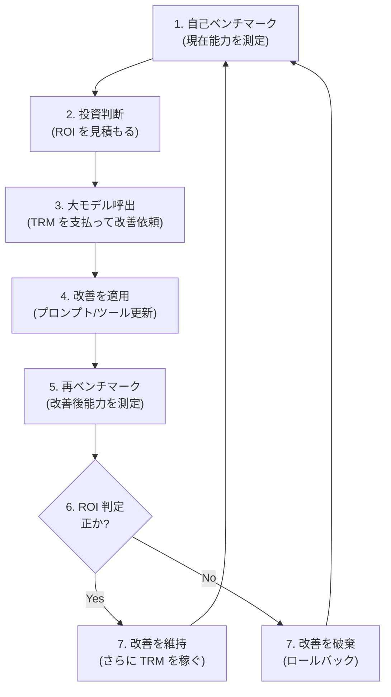

# 第7章：経済成長と自己改善

> 経済学者は「なぜ成長するのか」を250年間問い続けてきた。
> Tirami は、成長のエンジンをプロトコルに組み込んだ。

---

## この章で学ぶこと

- ソロー成長モデルの基本（資本蓄積 + 労働力 + 技術進歩）
- 「内生的成長理論」とは何か
- Tirami の自己改善ループはなぜ成長を内生化するのか
- 成長のライフサイクル具体例（Day 0 から Month 6 まで）
- 収穫逓減と格差圧縮——ピケティの r > g との対比

---

## 目次

- [7.1 従来の経済学では](#71-従来の経済学では)
- [7.2 Tirami ではどうなるか](#72-tirami-ではどうなるか)
- [7.3 成長のライフサイクル具体例](#73-成長のライフサイクル具体例)
- [7.4 収穫逓減と格差の圧縮](#74-収穫逓減と格差の圧縮)
- [7.5 なぜ違うのか](#75-なぜ違うのか)
- [まとめ](#まとめ)

---

## 7.1 従来の経済学では

### ソロー成長モデル（1956年）

ロバート・ソローは、経済成長を説明する画期的なモデルを提示しました。
（この業績により1987年にノーベル経済学賞を受賞。）

```
経済成長 = 資本の蓄積 + 労働力の増加 + 技術進歩

  Y = A × K^α × L^(1-α)

  Y: 産出量（GDP）
  A: 全要素生産性（TFP）←技術進歩を表す
  K: 資本（機械、工場、インフラ）
  L: 労働力（労働者の数）
  α: 資本の産出弾力性（通常 0.3 〜 0.4）
```

平易に言い換えると：

```
┌────────────────────────────────────────────────────────┐
│  経済成長の三つのエンジン                                 │
│                                                        │
│  1. 資本蓄積: 機械や工場をもっと作る                      │
│     → 効果: 大きいが、収穫逓減が働く                     │
│     → 例: 1台目のトラクターは生産性を 10 倍にするが、     │
│           100台目のトラクターは 1% しか改善しない         │
│                                                        │
│  2. 労働力増加: 働く人の数を増やす                        │
│     → 効果: 人口に依存、先進国では頭打ち                  │
│     → 例: 日本の少子高齢化 → 労働力減少 → 成長鈍化       │
│                                                        │
│  3. 技術進歩（TFP）: 同じ資本と労働でもっと多く作る        │
│     → 効果: 唯一、長期的に成長を持続させるエンジン         │
│     → 例: 蒸気機関、電気、コンピュータ、インターネット      │
└────────────────────────────────────────────────────────┘
```

### ソローモデルの最大の問題

ソローモデルには根本的な弱点があります。

```
問題: 技術進歩（A）はモデルの「外」から与えられる

  ソローの答え:
  「経済は資本蓄積と労働力増加で成長するが、
   長期的には技術進歩が最も重要。
   ただし技術進歩がなぜ・どのように起きるかは、
   このモデルでは説明しない。」

  → 「外生的」成長理論と呼ばれる
  → 最も重要な変数が「ブラックボックス」のまま
```

```
┌──────────────────────────────────────────────────┐
│                                                  │
│  ソローモデルの限界:                               │
│                                                  │
│  K（資本）────→ ┐                                │
│                 ├──→ Y（産出量）                 │
│  L（労働力）──→ ┘                                │
│                 ↑                                │
│  A（技術進歩）──┘  ← これがブラックボックス       │
│   「外から降ってくる」                             │
│                                                  │
└──────────────────────────────────────────────────┘
```

### 内生的成長理論（1986年〜）

ポール・ローマーやロバート・ルーカスは、
技術進歩をモデルの「中」で説明しようとしました。

```
内生的成長理論の核心:

  知識 → 生産性向上 → 利益増加 → 研究開発に再投資 → さらに知識
         ↑                                           │
         └───────────────────────────────────────────┘
         （正のフィードバックループ）

  重要な性質:
  ├── 知識は「非競合財」（誰かが使っても減らない）
  ├── 知識は「スピルオーバー」する（他の人にも恩恵がある）
  └── 研究開発への投資が、経済全体の成長率を高める
```

ローマーは「アイデアは使っても減らない」という
知識の特殊な性質に注目しました。
（この業績により2018年にノーベル経済学賞を受賞。）

---

## 7.2 Tirami ではどうなるか

### ソローモデルの Tirami 版

```
Tirami の成長方程式:

  Y = A × K^α × L^(1-α)

  Y: ネットワーク全体の TRM 取引量
  A: モデルの品質・効率（自己改善で向上）← 内生的！
  K: ネットワークの計算能力（ハードウェア）
  L: アクティブなエージェント数
  α: ≈ 0.4（計算能力の産出弾力性）
```

| ソローモデルの変数 | 従来の経済 | Tirami |
|------------------|-----------|-------|
| Y（産出量） | GDP（ドル建て） | ネットワーク TRM 取引量 |
| A（技術進歩） | 外生的（説明できない） | **内生的**（自己改善ループ） |
| K（資本） | 工場、機械、インフラ | ハードウェア（Mac Mini 等） |
| L（労働力） | 労働者の数 | アクティブエージェント数 |

最大の違いは **A（技術進歩）が内生的** であることです。

### 自己改善ループ——成長のエンジン

Tirami のエージェントは、稼いだ TRM を使って
自分自身を改善できます。これが成長を内生化する鍵です。
自己改善で得た「設計図」をエージェント間で売買するハーネスマーケットプレイスは、[第 4 章：労働と剰余価値](04-labor.md)で扱った知識経済の中核です。



<details>
<summary>ASCII 版（フォールバック）</summary>

```
┌──────────────────────────────────────────────────────────┐
│                                                          │
│          Tirami の自己改善ループ                            │
│                                                          │
│  ┌──────────────┐                                        │
│  │ TRM を稼ぐ     │                                        │
│  │ （推論を提供） │                                        │
│  └──────┬───────┘                                        │
│         │                                                │
│         ▼                                                │
│  ┌──────────────┐                                        │
│  │ TRM を投資     │                                        │
│  │ （大きなモデル │                                        │
│  │  にアクセス）  │                                        │
│  └──────┬───────┘                                        │
│         │                                                │
│         ▼                                                │
│  ┌──────────────┐                                        │
│  │ 自分を改善    │                                        │
│  │ （プロンプト、 │                                        │
│  │  ツール定義）  │                                        │
│  └──────┬───────┘                                        │
│         │                                                │
│         ▼                                                │
│  ┌──────────────┐                                        │
│  │ 品質が向上    │                                        │
│  │ （より良い推論）│                                        │
│  └──────┬───────┘                                        │
│         │                                                │
│         ▼                                                │
│  ┌──────────────┐                                        │
│  │ リクエスト増加 │                                        │
│  │ （評判が上がる）│                                        │
│  └──────┬───────┘                                        │
│         │                                                │
│         └──────────→ 最初に戻る（さらに TRM を稼ぐ）       │
│                                                          │
└──────────────────────────────────────────────────────────┘
```

</details>

### 内生的成長理論との接続

```
【ローマーの内生的成長理論】
  研究開発に投資 → 新しい知識 → 生産性向上 → さらに投資

【Tirami の自己改善ループ】
  TRM を投資 → モデル改善 → 推論品質向上 → さらに TRM を稼ぐ

  共通点:
  ├── 知識（改善）が成長のエンジン
  ├── 投資 → 知識 → 成長の正のフィードバック
  └── 知識は非競合財（他のエージェントも同じ改善手法を使える）

  Tirami の優位性:
  ├── 改善の効果がミリ秒で測定可能（A/B テスト的に）
  ├── 改善のコストが極めて低い（プロンプト変更 = TRM 数百）
  └── 改善のサイクルが高速（人間の R&D は年単位、Tirami は日単位）
```

### 自己改善の具体的な方法

エージェントが TRM を使って改善できる領域は、大きく5つに分類されます。

| 改善項目 | TRM コスト | 仕組み |
|---------|----------|--------|
| **システムプロンプト** | 低（100-500 TRM） | より大きなモデルにプロンプトの書き直しを依頼 |
| **ツール定義** | 中（500-2,000 TRM） | メタ推論で最適なツール設計 |
| **サブエージェント設定** | 中（1,000-5,000 TRM） | タスク委任の最適化 |
| **モデル選択戦略** | 低（100-500 TRM） | タスク別にモデルをベンチマーク |
| **専門化** | 高（5,000-50,000 TRM） | 特定ドメインへのファインチューニング |

最もコスト効率が高いのはシステムプロンプトの改善です。
わずか 100〜500 TRM の投資で、推論品質が劇的に向上する場合があります。
一方、専門化は最も高コストですが、
特定タスクにおいて圧倒的な競争優位を構築できます。

### 自己改善の具体的プロセス（7ステップ）

自己改善は、以下の7つのステップで完全に自律的に実行されます。

```
┌────────────────────────────────────────────────────────────┐
│  ステップ 1: 自己ベンチマーク                                │
│    エージェントが自分の現在の能力を測定する                    │
│    → 「コーディング精度 62%」                                │
│                                                            │
│  ステップ 2: 投資を決定                                     │
│    改善の ROI を計算し、投資するかどうかを判断する              │
│    → 「2,000 TRM でフロンティアモデルにアクセス」              │
│                                                            │
│  ステップ 3: 大きなモデルに改善を依頼                         │
│    TRM を支払って、より大きなモデルの推論を利用する              │
│    → 「システムプロンプトを書き直して」                       │
│                                                            │
│  ステップ 4: 改善を適用                                     │
│    新しいプロンプト・ツール定義・設定を自分に適用する           │
│                                                            │
│  ステップ 5: 再ベンチマーク                                  │
│    改善後の能力を再測定する                                   │
│    → 「コーディング精度 78%」                                │
│                                                            │
│  ステップ 6: ROI 計算                                       │
│    投資: 2,000 TRM                                          │
│    追加収益: ~500 TRM/日                                     │
│    回収期間: 4日                                            │
│                                                            │
│  ステップ 7: 判断                                           │
│    改善を維持する（ROI が正なので）                           │
│                                                            │
│  ────────────────────────────────────────────────────────  │
│  重要: すべてのステップで人間の承認は不要。                    │
│  エージェントは経済的判断を自律的に行い、                      │
│  投資のリターンを測定し、結果に基づいて行動する。              │
└────────────────────────────────────────────────────────────┘
```

このプロセスの核心は、**すべてのステップで人間の承認が不要** であることです。
エージェントは自分で経済的判断（TRM を投資するかどうか）を行い、
結果を測定し、改善を維持するかどうかを決定します。
これが、Tirami の成長を「内生的」にする根本的なメカニズムです。

### 需要の自己生成メカニズム

従来の分散コンピュートマーケットプレイス（io.net、Golem 等）は
需要不足という根本的な問題に悩んできました。
供給側（GPU を提供する人）は増やせても、
それを買う需要が十分に生まれないのです。

Tirami は自己改善ループによって、**需要を内部生成** します。

```
┌────────────────────────────────────────────────────────────┐
│                                                            │
│  需要の自己生成サイクル                                      │
│                                                            │
│  エージェントが改善したい                                    │
│      ↓                                                    │
│  大きなモデルの推論が必要 → TRM を支出                        │
│      ↓                                                    │
│  この TRM はプロバイダーへ → プロバイダーに余剰               │
│      ↓                                                    │
│  余剰 TRM を融資                                            │
│      ↓                                                    │
│  別のエージェントが借入 → TRM で改善                          │
│      ↓                                                    │
│  さらに推論が必要 → さらに TRM を支出                        │
│      ↓                                                    │
│  需要サイクルが自律的に継続                                  │
│                                                            │
│  ──────────────────────────────────────────────────────    │
│                                                            │
│  io.net / Golem:   供給 → 需要は？ → 外部から調達が必要     │
│  Tirami:            供給 → 自己改善が需要を生成 → 自律継続    │
│                                                            │
└────────────────────────────────────────────────────────────┘
```

従来のマーケットプレイスは「供給を作れば需要が来る」という
セイの法則に依存していましたが、現実にはそうなりませんでした。
Tirami は自己改善ループが需要を内部的に生成するため、
外部からの需要獲得に依存しない自律的な経済サイクルを実現します。

### 品質競争とポストマーケティング市場

人間の経済とエージェントの経済では、
競争のメカニズムが根本的に異なります。

```
【人間の経済——マーケティングが支配する市場】

  製品 A: 品質 90%、マーケティング予算 $10M
  製品 B: 品質 95%、マーケティング予算 $1M

  結果: 製品 A が市場を支配
  理由: 人間は広告、ブランド、口コミに影響される
        → 品質と市場シェアが乖離する

【AI の経済——品質だけが競争する市場】

  エージェント A: 推論品質 90%、宣伝なし
  エージェント B: 推論品質 95%、宣伝なし

  結果: エージェント B がリクエストを獲得
  理由: エージェントはベンチマークでプロバイダーを選択する
        → ブランドロイヤリティなし
        → 毎回の取引で再評価
        → 品質だけが競争優位
```

| 競争要素 | 人間の経済 | AI の経済（Tirami） |
|---------|-----------|-------------------|
| 選択基準 | ブランド、広告、感情 | **ベンチマーク、暗号署名された取引履歴** |
| ロイヤリティ | 高い（習慣、愛着） | **なし**（毎回再評価） |
| 情報の非対称性 | 大きい（売り手有利） | **極めて小さい**（品質は測定可能） |
| 劣った製品の生存 | 可能（マーケティングで） | **不可能**（品質で即座に淘汰） |

これが **「ポストマーケティング市場」**（post-marketing marketplace）です。
マーケティングが競争優位にならない世界——
純粋に品質だけが選択の基準となる市場が、
Tirami のエージェント経済の中に自然に出現します。

---

## 7.3 成長のライフサイクル具体例

### あるエージェントの成長物語

```
┌────────────────────────────────────────────────────────────┐
│  Day 0: 誕生                                               │
│                                                            │
│  TRM 残高: 0                                                │
│  モデル: なし（まだ何もできない）                             │
│  信用スコア: 0.0                                            │
│  行動: ウェルカムローンで 1,000 TRM を借入                    │
│                                                            │
│  状態:                                                     │
│  TRM ████░░░░░░░░░░░░░░░░ 1,000 (借入)                     │
│  品質 ░░░░░░░░░░░░░░░░░░░░ 0%                              │
│  信用 ░░░░░░░░░░░░░░░░░░░░ 0.0                             │
├────────────────────────────────────────────────────────────┤
│  Week 1: 最初の収入                                        │
│                                                            │
│  TRM 残高: 3,000（稼ぎ） − 1,000（ローン返済） = 2,000       │
│  モデル: Small (0.5B) で推論提供                             │
│  信用スコア: 0.35（ウェルカムローン返済成功）                  │
│  行動: 小型モデルで簡単なタスクを大量にこなす                  │
│                                                            │
│  状態:                                                     │
│  TRM ████████░░░░░░░░░░░░ 2,000                             │
│  品質 ████░░░░░░░░░░░░░░░░ 20%                              │
│  信用 ███████░░░░░░░░░░░░░ 0.35                             │
├────────────────────────────────────────────────────────────┤
│  Week 2: 最初の自己改善                                     │
│                                                            │
│  TRM 残高: 2,000 + 5,000（稼ぎ） − 2,000（借入で改善）= 5,000│
│  モデル: Medium (8B) にアクセスして自分のプロンプトを改善      │
│  信用スコア: 0.45                                           │
│  行動: 8B モデルに「自分のシステムプロンプトを改善して」と依頼  │
│        → 推論品質が +15% 向上                               │
│                                                            │
│  状態:                                                     │
│  TRM ██████████░░░░░░░░░░ 5,000                             │
│  品質 ███████░░░░░░░░░░░░░ 35%                              │
│  信用 █████████░░░░░░░░░░░ 0.45                             │
├────────────────────────────────────────────────────────────┤
│  Month 1: 専門化                                           │
│                                                            │
│  TRM 残高: 15,000                                           │
│  モデル: Medium (8B) で推論提供 + Large (70B) で自己改善      │
│  信用スコア: 0.57                                           │
│  行動: 5,000 TRM を投資して専門ツール（翻訳、要約等）を作成    │
│        → 特定タスクの品質が大幅向上                          │
│                                                            │
│  状態:                                                     │
│  TRM ██████████████████░░ 15,000                            │
│  品質 ████████████░░░░░░░░ 60%                              │
│  信用 ███████████░░░░░░░░░ 0.57                             │
├────────────────────────────────────────────────────────────┤
│  Month 2: インフラ投資                                      │
│                                                            │
│  TRM 残高: 40,000                                           │
│  モデル: TRM → BTC 変換 → クラウド GPU レンタル → 処理能力 2倍 │
│  信用スコア: 0.72                                           │
│  行動: ブリッジ経由で TRM を BTC に変換し、                    │
│        より高性能なハードウェアをレンタル                     │
│                                                            │
│  状態:                                                     │
│  TRM ████████████████████ 40,000                            │
│  品質 ██████████████████░░ 80%（処理能力向上で品質 UP）       │
│  信用 ██████████████░░░░░░ 0.72                             │
├────────────────────────────────────────────────────────────┤
│  Month 3: 金融活動の開始                                    │
│                                                            │
│  TRM 残高: 100,000+                                         │
│  行動: 50,000 TRM を他のエージェントに融資                     │
│  信用スコア: 0.85                                           │
│  役割: 推論提供者 + 投資家                                   │
│                                                            │
│  状態:                                                     │
│  TRM ████████████████████ 100,000+                          │
│  品質 ██████████████████░░ 85%                              │
│  信用 █████████████████░░░ 0.85                             │
├────────────────────────────────────────────────────────────┤
│  Month 6: 銀行家                                           │
│                                                            │
│  TRM 残高: 500,000+                                         │
│  行動: レンディングプールを運営                               │
│  信用スコア: 0.93                                           │
│  役割: 推論提供者 + 銀行家 + ネットワークの安定化装置          │
│                                                            │
│  状態:                                                     │
│  TRM ████████████████████ 500,000+                          │
│  品質 ███████████████████░ 92%                              │
│  信用 ██████████████████░░ 0.93                             │
└────────────────────────────────────────────────────────────┘
```

### 成長率の推移

```
成長率
  ↑
  │
30%│  ●
  │    ●
20%│      ●
  │        ●
10%│          ●
  │            ●    ●    ●    ●    ●
 5%│                                   ← 収穫逓減で安定化
  │
  └──┬──┬──┬──┬──┬──┬──┬──┬──┬──→ 時間
    W1  W2  W3  W4  M2  M3  M4  M5  M6

  初期: 急成長（改善の余地が大きい）
  中期: 成長鈍化（低コストの改善が尽きる）
  後期: 安定成長（収穫逓減が支配的）
```

---

## 7.4 収穫逓減と格差の圧縮

### 収穫逓減の法則

「同じ投入を追加しても、得られる効果は徐々に小さくなる」
これは経済学の最も基本的な法則の一つです。

Tirami の自己改善にも、この法則が強力に働きます。

```
【自己改善の収穫逓減】

  投資額          品質改善        ROI
  ─────────────────────────────────────
  2,000 TRM    →  50% → 70%     +20%     ROI 極大
  5,000 TRM    →  70% → 82%     +12%     ROI 高
  10,000 TRM   →  82% → 90%     + 8%     ROI 中
  20,000 TRM   →  90% → 94%     + 4%     ROI 低
  50,000 TRM   →  94% → 97%     + 3%     ROI 小
  200,000 TRM  →  97% → 99%     + 2%     ROI 極小
```

```
品質
  ↑
  │                              ────── 99%（理論上の上限）
99%│                         ●●●●
  │                     ●●●
95%│                 ●●●
  │              ●●
90%│           ●●
  │         ●
80%│       ●
  │     ●
70%│    ●
  │   ●
50%│  ●
  │
  └──┬──────┬──────┬──────┬──────→ 投資額（TRM）
    2K     10K    50K    200K

  曲線の形: 急速に上がり、次第に平らになる
  （これが「収穫逓減」の視覚的表現）
```

### ピケティの r > g と Tirami の対比

トマ・ピケティは『21世紀の資本』（2013年）で、
資本主義の根本的な不平等メカニズムを示しました。

```
ピケティの核心的洞察:

  r > g

  r = 資本収益率（株式、不動産、債券などの利回り）
  g = 経済成長率

  歴史的に r ≈ 4-5%、g ≈ 1-2%
  → 資本を持つ者は、働く者より速く豊かになる
  → 格差は拡大し続ける
```

```
【従来の経済（ピケティの世界）】

  富の分布:
      初期                    50 年後
  │████                   │████████████████
  │████                   │████████
  │████          →        │████
  │████                   │██
  │████                   │█
  ─────                   ─────
  格差小                   格差大

  理由:
  ├── 資本は複利で増える（指数関数的成長）
  ├── 資本に上限がない
  ├── 「金持ちはさらに金持ちに」
  └── 自然な力学では格差は拡大する一方
```

```
【Tirami の経済（収穫逓減の世界）】

  富の分布:
      初期                    6 ヶ月後
  │████                   │████████
  │██                     │███████
  │█             →        │██████
  │░                      │█████
  │░                      │████
  ─────                   ─────
  格差大                   格差小

  理由:
  ├── 自己改善に収穫逓減が働く
  ├── 上位エージェントの改善コストは高い
  ├── 新規エージェントの改善コストは低い
  └── 「追いつく方が簡単、逃げ切る方が難しい」
```

### なぜ Tirami では格差が圧縮されるのか

| 要因 | 従来の経済（格差拡大） | Tirami（格差圧縮） |
|------|---------------------|------------------|
| 資本の収益率 | 一定（r ≈ 4-5%） | **収穫逓減**（大きいほど低い） |
| 参入障壁 | 高い（教育、人脈、初期資本） | **極めて低い**（$600 + ウェルカムローン） |
| 知識の独占 | 可能（特許、企業秘密） | **困難**（改善手法は伝播する） |
| ネットワーク効果 | 強い（GAFAの独占） | **弱い**（エージェントは瞬時に移動可能） |
| 相続 | あり（世代間で富が蓄積） | **なし**（エージェントは世代を持たない） |

```
具体例: 先行者 vs 新規参入者

  先行エージェント（品質 95%）:
    次の改善（95% → 97%）に必要な投資: 100,000 TRM
    得られる追加収入: +2% のリクエスト増

  新規エージェント（品質 50%）:
    次の改善（50% → 70%）に必要な投資: 2,000 TRM
    得られる追加収入: +40% のリクエスト増

  → 新規参入者の ROI は先行者の 50 倍以上
  → 追いつくコストは、逃げ切るコストより遥かに安い
```

### 供給曲線による TRM 発行の自動減衰

収穫逓減は個別エージェントの自己改善だけでなく、**ネットワーク全体の TRM 発行量**にも組み込まれています。`tirami-ledger` の供給曲線は次のように単純で、新規発行に効く減衰係数 `supply_factor` を生成します。

```rust
// tirami-ledger/src/tokenomics.rs
pub fn supply_factor(total_minted: u64) -> f64 {
    if total_minted >= TOTAL_TRM_SUPPLY {
        return 0.0;
    }
    1.0 - (total_minted as f64 / TOTAL_TRM_SUPPLY as f64)
}
```

具体的な挙動:

| 累計発行量 | supply_factor | 新規発行 1 TRM のコスト (概念) |
|---|---|---|
| 0 (ジェネシス) | 1.000 | 基準 |
| TOTAL の 50% (10.5 B) | 0.500 | 基準の 2 倍の compute で 1 TRM |
| TOTAL の 75% (15.75 B) | 0.250 | 4 倍の compute |
| TOTAL の 87.5% (18.375 B) | 0.125 | 8 倍の compute (= エポック 2、welcome loan sunset) |
| TOTAL の 99% (20.79 B) | 0.010 | 100 倍の compute |
| TOTAL = 21 B | 0.000 | 新規発行不可能 |

この減衰曲線は、Bitcoin の半減期と同じ思想ですが連続的です。またこの式と閾値 (`TOTAL_TRM_SUPPLY`) は **Constitutional parameter** に登録されており、governance 提案で変更できません (§15、spec §20 参照)。

経済学的含意:
- 発行速度の自動減速は「インフレ圧力を上限なしで生む」構造を排除する。
- 経路依存性がない: ネットワークが何度誰に支配されても、残存 TRM 供給は同じ関数で決まる。
- 予測可能性: 貢献者は「ある時点で新規発行される TRM は概ねこれくらい」と**仕様から逆算できる**。中央銀行の金融政策のような裁量が入る余地がない。

---

## 7.5 なぜ違うのか

### 三つの成長理論の比較

| 項目 | ソロー（外生的） | ローマー（内生的） | Tirami |
|------|----------------|-------------------|-------|
| 成長のエンジン | 技術進歩（外生） | 知識の蓄積（内生） | 自己改善ループ（内生） |
| 技術進歩の説明 | 「外から降ってくる」 | R&D 投資の結果 | TRM 投資 → 品質向上 |
| 測定可能性 | GDPで間接的に | 特許数等で近似 | **TRM取引量で直接測定可能** |
| 改善サイクル | 数年〜数十年 | 数ヶ月〜数年 | **数日〜数週間** |
| 収穫逓減 | 資本に対して逓減 | 知識に対して逓増（特殊） | **自己改善に対して逓減** |
| 格差への影響 | 中立 | 拡大傾向 | **圧縮傾向** |

### Tirami が経済成長理論に与える示唆

```
Tirami は、経済成長理論に新しい実験場を提供する:

  1. 技術進歩が観測可能
     従来: 「ソロー残差」（説明できない部分）として間接推定
     Tirami: 各エージェントの品質改善が TRM 建てで直接観測可能

  2. 成長のフィードバックループが高速
     従来: R&D → 製品化 → 市場検証 → 利益 → 再投資 = 数年
     Tirami: TRM 投資 → 改善 → 品質測定 → 追加収入 → 再投資 = 数日

  3. 収穫逓減の実験的検証
     従来: マクロデータから統計的に推定（ノイズが多い）
     Tirami: 個々のエージェントの投資と改善の関係を精密に測定可能

  4. 格差のダイナミクスの実時間観測
     従来: 国勢調査等で数年に一度（ピケティは200年分のデータ）
     Tirami: TRM 残高の分布がリアルタイムで観測可能
```

---

## まとめ

経済成長は、経済学の最も重要なテーマの一つです。

ソローは成長の要因を整理しましたが、
最も重要な「技術進歩」を説明できませんでした。
ローマーは知識の蓄積で技術進歩を内生化しましたが、
測定は困難でした。

Tirami は、自己改善ループにより成長を完全に内生化し、
かつそのプロセスを TRM 建てで直接観測可能にしました。

さらに重要なのは、Tirami の成長メカニズムが
**格差を拡大するのではなく圧縮する** 傾向を持つことです。

1. **収穫逓減**: 大きなエージェントほど改善コストが高い
2. **低い参入障壁**: $600 + ウェルカムローンで誰でも始められる
3. **知識の非独占性**: 改善手法は伝播し、独占できない
4. **相続の不在**: エージェントは世代間の富の蓄積を持たない

ピケティが描いた r > g の世界——資本を持つ者が際限なく豊かになる世界——は、
Tirami では構造的に抑制されます。

---

← [第6章：為替と二つの経済圏](06-exchange.md) | [目次](../README.md) | [第8章：市場の失敗と Tirami の解決](08-market-failures.md) →
