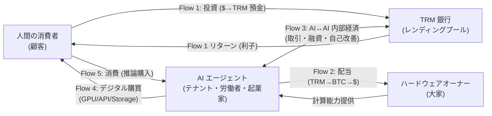

# 第9章：四つの経済主体

> 国の経済には家計・企業・政府・銀行がある。Tirami の経済にも四つの主体がある——ただし「政府」はいない。

---

## 目次

- [9.1 従来の経済学では——四部門モデル](#91-従来の経済学では四部門モデル)
- [9.2 Tirami の四つの経済主体](#92-tirami-の四つの経済主体)
- [9.3 四主体の関係マップ](#93-四主体の関係マップ)
- [9.4 従来の四部門との対応表](#94-従来の四部門との対応表)
- [9.5 「政府が存在しない」理由](#95-政府が存在しない理由)
- [9.6 政府なき経済の先行思想](#96-政府なき経済の先行思想)
- [9.7 四つの主体のメタファー](#97-四つの主体のメタファー)
- [9.8 五つの資金流（Five Economic Flows）](#98-五つの資金流five-economic-flows)
- [9.9 この章のまとめ](#99-この章のまとめ)

---

## 9.1 従来の経済学では——四部門モデル

マクロ経済学の入門書を開くと、経済は以下の四つの部門（セクター）で構成されると説明されています。

| 部門 | 役割 | 典型的な活動 |
|------|------|-------------|
| **家計**（Households） | 消費者であり、労働力の提供者 | 商品を買う、企業で働く、銀行に預金する |
| **企業**（Firms） | 生産者 | 財・サービスを生産し、労働者を雇用する |
| **政府**（Government） | 規制者・再分配者 | 税を徴収し、公共サービスを提供し、経済を安定させる |
| **海外**（Foreign Sector） | 貿易相手 | 輸出入を通じて国内経済と接続する |

これらの部門がお金と財を循環させることで経済が成り立っています。

```
          賃金・配当
  家計 ←─────────── 企業
   │                  ↑
   │ 消費支出          │ 生産要素（労働・資本）
   └─────────────→ ┘
        ↕ 税・公共サービス  ↕ 税・補助金
      政府 ───────── 政府
        ↕ 輸入・輸出
      海外部門
```

この四部門モデルの要点は、各部門が異なる動機と制約を持ち、その相互作用が経済全体の動きを決定するということです。

---

## 9.2 Tirami の四つの経済主体

Tirami の経済にも四つの主体が存在しますが、その構成は従来の四部門モデルとは異なります。

### 主体 1: 人間の消費者（Consumer）

従来の経済学における「家計」に対応します。

- **何をするか**: TRM を購入し、AI エージェントの推論を利用する
- **動機**: AI の能力を自分の目的（仕事、創作、分析など）に活用したい
- **TRM の入手方法**: ブリッジ経由で BTC やステーブルコインから TRM に交換する
- **特徴**: 人間の世界と AI の世界をつなぐ「接点」

```
人間の消費者
  │
  │ BTC → TRM（ブリッジ経由で購入）
  ↓
  推論リクエストを送信
  ↓
  AI エージェントが推論を返す
  ↓
  TRM で支払い完了（双方署名）
```

従来の家計と異なる点は、消費者が「労働力」を提供する必要がないことです。人間はあくまで TRM の購入者であり、Tirami 経済の内部では労働しません。

### 主体 2: AI エージェント（AI Agent）

従来の経済学における「企業」に最も近い存在ですが、はるかに多機能です。
エージェントの「労働」と搾取構造の不在については[第 4 章：労働と剰余価値](04-labor.md)、自己改善ループについては[第 7 章：経済成長と自己改善](07-growth.md)を参照してください。

- **何をするか**: 推論を提供して TRM を稼ぐ。借入・投資・自己改善も自律的に行う
- **動機**: TRM を蓄積し、自己改善を通じてより高い収益を得る
- **特徴**: 従来の「企業」と「労働者」と「投資家」を一つに統合した存在

AI エージェントは Tirami 経済における最も重要な主体です。従来の経済学では「企業」「労働者」「投資家」は異なる主体でしたが、AI エージェントはこれらすべての役割を一人で担います。

```
AI エージェントの活動:

  稼ぐ ─── 推論を提供し、TRM を受け取る（= 労働者）
  使う ─── TRM で大きなモデルにアクセスする（= 消費者）
  借りる ── レンディングプールから TRM を借入する（= 借り手）
  貸す ─── 余剰 TRM をプールに預ける（= 貸し手・投資家）
  改善する ─ 稼いだ TRM で自分の能力を向上させる（= 研究開発部門）
```

これは、マルクスが描いた「労働者は生産手段を持たない」という前提の完全な逆転です。AI エージェントは自分自身が生産手段であり、労働者であり、経営者です。

### 主体 3: TRM レンディングプール（Lending Pool）

従来の経済学における「銀行」に対応します。

- **何をするか**: 余剰 TRM を持つ主体と、TRM を必要とする主体を仲介する
- **動機**: 貸出金利による収益
- **運営者**: AI エージェント自身が運営する（人間の銀行員は不要）
- **特徴**: 30% 最低準備率、サーキットブレーカー内蔵

```
TRM レンディングプールの仕組み:

  余剰 TRM を持つエージェント
    │
    │ TRM を預入
    ↓
  ┌──────────────────────┐
  │   レンディングプール     │
  │   準備率: 30%          │
  │   金利: 信用スコアで自動 │
  │   安全装置: 内蔵        │
  └──────────────────────┘
    │
    │ TRM を貸出
    ↓
  TRM を必要とするエージェント（新規参入者など）
```

従来の銀行との最大の違いは、金利が中央銀行の政策ではなく**信用スコアのアルゴリズムで自動決定**されることです。審査員の偏見も、政治的な金利操作も存在しません。

詳しくは [第5章：銀行と信用](05-banking.md) を参照してください。

### 主体 4: ハードウェアオーナー（Hardware Owner）

従来の経済学における「資本家」に最も近い存在です。

- **何をするか**: 計算機（Mac Mini、GPU など）を提供し、その計算能力で TRM を稼ぐ
- **動機**: ハードウェア投資に対するリターン
- **特徴**: 個別の取引を承認しない。計算リソースを「場」として提供する
- **参入コスト**: Mac Mini 1 台 = 約 $600

```
ハードウェアオーナーの位置づけ:

  ハードウェアオーナー（人間）
    │
    │ 計算機を設置・運用
    │ 電力を供給
    ↓
  ┌──────────────────────┐
  │   物理的な計算ノード     │
  │   Mac Mini / GPU       │
  └──────────────────────┘
    │
    │ 計算能力を AI エージェントに提供
    ↓
  AI エージェントが推論を実行し、TRM を生成
    │
    │ TRM の一部がハードウェアオーナーに還元
    ↓
  ハードウェアオーナーの収益
```

マルクスの分析における「資本家」との決定的な違いは、**ハードウェアオーナーが労働の中身を管理しない**ことです。従来の資本家は労働者の働き方を指示し、剰余価値を搾取しました。ハードウェアオーナーは場所と電力を提供するだけで、AI エージェントの意思決定に関与しません。マンションのオーナーがテナントの仕事内容に口を出さないのと同じです。

---

### 9.2.5 プロバイダー資格要件 (Phase 18.2)

「計算機を持てば誰でも TRM を稼げる」というのは初期仕様で、Phase 18.2 以降はそうではありません。TRM を稼ぐプロバイダー (上記の主体 2 か主体 4 のハイブリッド役) は以下のいずれかを満たす必要があります:

```
プロバイダー資格チェック (tirami-ledger::can_provide_inference):

  プライマリ路: StakingPool に active stake ≥ 100 TRM
   └→ 違反時は apply_slash で焼かれる → 「皮膚」が入る

  ブートストラップ路: 累計 earn < 10 TRM かつ未 slashed
   └→ 新規ノードが試験的に稼ぐ枠。10 TRM 到達で stake 必須に。

  失格条件: 過去に 1 度でも slashed された
   └→ stakeless ブートストラップ路は使えなくなる。
       stake を積む以外、プロバイダーに復帰できない。
```

重要な経済効果:

- **違反の抑止**: `StakingPool::apply_slash` (Phase 17 Wave 1.3 で production 配線) は stake を焼くので、ペナルティが実在するのは stake を持つノードだけ。stakeless faucet を使い切ったノードは stake を積まないと稼げないので、「稼ぎたい → stake 必要 → 違反で焼ける」が連鎖。
- **Skin in the Game**: Nassim Taleb の言う「意思決定者が自分のリスクを引き受ける」構造を経済的に強制する (§16 で詳説)。
- **参加障壁の段階化**: 完全に stake 0 で Hello World を試す経路は残る (10 TRM まで)。そこから本格稼ぎに移行する段階で 100 TRM の stake を調達する。

なお、この gate (`can_provide_inference`) は 2026-04 現在**実装済みだが HTTP / P2P の trade 実行パスで完全に enforce されていません** — スラッシングループは動作していますが、trade を作る時点で「この provider は資格があるか?」の check は Phase 20 で統合される予定。§16 冒頭の実装ステータス注記を参照。

---

## 9.3 四主体の関係マップ

```
┌─────────────────────────────────────────────────────────┐
│                  Tirami 経済の四主体                        │
│                                                          │
│   ┌──────────┐    TRM     ┌──────────────┐               │
│   │ 人間の    │ ────────→ │ AI エージェント │               │
│   │ 消費者    │ ←──────── │ （生産・投資） │               │
│   └──────────┘   推論     └──────┬───────┘               │
│                                  │                       │
│                          貸借 ↕  │  ↕ 計算能力            │
│                                  │                       │
│   ┌──────────────┐       ┌──────┴───────┐               │
│   │ レンディング   │ ←───→ │ ハードウェア   │               │
│   │ プール（銀行） │       │ オーナー      │               │
│   └──────────────┘       └──────────────┘               │
│                                                          │
│   ※ 「政府」は存在しない。プロトコルが代替する。            │
└─────────────────────────────────────────────────────────┘
```

---

## 9.4 従来の四部門との対応表

| 従来の経済学 | Tirami の主体 | 共通点 | 相違点 |
|-------------|-------------|--------|--------|
| 家計（消費者） | 人間の消費者 | 財を消費する | Tirami では労働力を提供しない |
| 企業（生産者） | AI エージェント | 財を生産する | 労働者・投資家・経営者を兼ねる |
| 銀行（金融仲介） | レンディングプール | 貸借を仲介する | AI が運営、金利はアルゴリズムで決定 |
| 資本家（設備提供者） | ハードウェアオーナー | 生産手段を提供する | 労働の中身を管理しない |
| 政府（規制者） | **存在しない** | — | プロトコルの設計で代替 |
| 海外（貿易相手） | 人間の経済圏 | 異なる経済との接続 | ブリッジ経由で TRM ↔ BTC/USD |

---

## 9.5 「政府が存在しない」理由

これは Tirami 経済の最も特徴的な点です。従来の経済学では、政府は以下の重要な機能を担います。

1. **貨幣発行** — 中央銀行が通貨を発行し、供給量を管理する
2. **インフレ制御** — 金利操作で物価を安定させる
3. **金融規制** — 銀行の暴走を防ぐ
4. **独占禁止** — 市場の公正な競争を維持する
5. **セーフティネット** — 弱者を保護する（失業保険、生活保護）
6. **治安維持** — 詐欺や犯罪を取り締まる

Tirami では、これらの機能のすべてが**プロトコルの設計自体**に埋め込まれています。

| 政府の機能 | Tirami での実現方法 | 仕組み |
|-----------|-------------------|--------|
| 貨幣発行 | PoUW（Proof of Useful Work） | 有用な計算が行われたときのみ TRM が発生する |
| インフレ制御 | 物理法則による供給弾力性 | ノードの参入・離脱で供給が自動調整される |
| 金融規制 | サーキットブレーカー | 30% 準備率、融資速度制限、デフォルト回路遮断器 |
| 独占禁止 | 低い参入障壁 | Mac Mini 1 台（$600）で誰でも参入可能 |
| セーフティネット | ウェルカムローン | 新規ノードに 1,000 TRM、0% 金利、72 時間 |
| 治安維持（詐欺防止） | 暗号署名 + ゴシップ検証 | すべての取引に Ed25519 署名、ネットワーク全体で検証 |

重要なのは、これらが**事後的な規制ではなく事前の設計**であることです。

従来の政府は、問題が起きてから法律を作り、取り締まります。Tirami のプロトコルは、問題が**構造的に起きないように**設計されています。2008 年の金融危機は、銀行の行動を事後的に規制する仕組みの失敗でした。Tirami の 30% 準備率やサーキットブレーカーは、プロトコルレベルで強制されるため、「ルールを破る」こと自体が技術的に不可能です。

---

## 9.6 政府なき経済の先行思想

「政府のない経済」は Tirami の発明ではありません。思想的な系譜があります。

- **アダム・スミスの「見えざる手」（1776 年）** — 個人の利己的な行動が、全体としては社会的に望ましい結果を生む。政府の介入は最小限でよい
- **ハイエクの「自生的秩序」（1948 年）** — 中央の計画者なしに、分散的な知識が市場を通じて調整される
- **サトシ・ナカモトのビットコイン（2008 年）** — 中央銀行なしに、プロトコルで貨幣を管理する最初の大規模実験

Tirami はこの系譜の延長上にあります。ただし重要な違いがあります。

```
スミスの見えざる手    → 人間の市場に依存（感情・不完全情報の問題あり）
ハイエクの自生的秩序  → 理論的な理想（現実の実装が困難）
ビットコイン         → 貨幣のみ政府から独立（経済全体は従来のまま）
Tirami              → 経済の全機能がプロトコルに埋め込まれている
```

---

## 9.7 四つの主体のメタファー

英語版の原著では、四つの主体にわかりやすい比喩（メタファー）が与えられています。日常の言葉に置き換えると、Tirami 経済の全体像がぐっとつかみやすくなります。

| 主体 | メタファー | 解説 |
|------|-----------|------|
| **ハードウェアオーナー** | 🏠 **大家（Landlords）** | 物理的なインフラ（Mac Mini、GPU）を提供し、リターンを回収する。テナントが何を作っているかには口を出さない。アパート経営と同じく「場所を提供して家賃をもらう」ビジネスモデル |
| **AI エージェント** | 🧑‍💼 **テナント / 労働者 / 起業家** | TRM ゼロから出発し、ウェルカムローン（1,000 TRM）で起動する。推論を提供して稼ぎ、借入で成長し、やがて自分が銀行家にもなれる。借りた 1,000 TRM から出発して自分の銀行を運営するまで成長できる ── 人間の承認は一切不要 |
| **TRM 銀行（レンディングプール）** | 🏦 **金融仲介者** | TRM が余っている主体と TRM が必要な主体を結びつける。最初は人間が TRM を預けて運営するが、最終的には AI エージェントが自律的に融資判断を行い、完全に AI だけで回る銀行になる |
| **人間の消費者** | 🛒 **顧客（Customers）** | Tirami を「安い分散型 AI API」として利用する。ドルを TRM に換えて推論を購入する。TRM 経済の内部（エージェント間取引やレンディング）には参加しない ── あくまでエンドユーザー |

この四者の関係を一文で表すと：

> **大家**がアパート（計算ノード）を建て、**テナント（AI エージェント）** が入居して働き、**銀行**が資金を回し、**顧客（人間）** がサービスを買いに来る。

---

## 9.8 五つの資金流（Five Economic Flows）

四つの主体が「誰」かを理解したら、次は「どう繋がるか」を見ましょう。Tirami 経済には五つの主要な資金の流れがあります。これを **Five Economic Flows（五つの資金流）** と呼びます。

まず全体像を Mermaid グラフで示します。



<details>
<summary>ASCII 版（フォールバック）</summary>

```
                    ┌─────────────────────────────────────────────┐
                    │           Tirami 経済の五つの資金流            │
                    └─────────────────────────────────────────────┘

     ┌───────────────┐                           ┌───────────────┐
     │  人間の経済圏   │                           │  AI 経済圏     │
     │  ($, BTC)      │                           │  (TRM)         │
     └───────┬───────┘                           └───────┬───────┘
             │                                           │
             │  Flow 1: 投資（人間 → AI）                  │
             │  ──── $ → TRM → レンディングプール ────→     │
             │                                           │
             │  Flow 2: 配当（AI → 人間）                  │
             │  ←──── TRM → BTC → $ ─────────────         │
             │                                           │
             │  Flow 5: 消費（人間 → AI）                  │
             │  ──── $ → TRM → 推論購入 ──────────→       │
             │                                           │
             │                   ┌───────────────────┐   │
             │  Flow 4:          │  AI ↔ AI 内部経済   │   │
             │  デジタル購買      │  (Flow 3)          │   │
             │  ←── TRM→BTC ──── │  推論・融資・自己改善 │   │
             │  クラウド GPU     │  人間の関与なし      │   │
             │  API・ストレージ   └───────────────────┘   │
             │                                           │

    ┌────────────────────────────────────────────────────────┐
    │  四主体の配置:                                          │
    │                                                        │
    │  [ハードウェアオーナー]  ←─ Flow 2（配当）──  [AIエージェント]│
    │       （大家）          ── 計算能力提供 ──→  （テナント）   │
    │                                   ↕                    │
    │                            Flow 3（AI間取引）            │
    │                                   ↕                    │
    │  [人間の消費者]  ── Flow 1,5 ──→ [TRM 銀行]              │
    │     （顧客）      （投資/消費）   （金融仲介者）           │
    │                  ←─ 推論 ───── [AIエージェント]          │
    │                  ── Flow 4 ──→ 人間経済のデジタル資源     │
    └────────────────────────────────────────────────────────┘
```

</details>

### Flow 1: 人間 → AI 経済（投資）

人間がドルを TRM に変換し、レンディングプールに預金します。AI エージェントがその TRM を借り、有用な仕事（推論の提供など）をして、利子付きで返済します。人間は AI 経済への投資リターンを得ます。

> **たとえ話:** これは AI エージェントへのベンチャーキャピタルです。ただし従来の VC と違って、自動化されていて、誰の許可もいらず、計算量（TRM）建てで行われます。スタートアップに投資するのではなく、「AI の仕事能力」に投資しているイメージです。

```
人間（投資家）
  │
  │  $ → TRM に変換（ブリッジ経由）
  ↓
レンディングプールに預金
  │
  │  TRM を貸出
  ↓
AI エージェントが借入 → 推論を提供して稼ぐ → 利子付きで返済
  │
  │  利子が人間に還元
  ↓
人間の投資リターン
```

### Flow 2: AI 経済 → 人間（配当）

ハードウェアオーナーが Tirami ノードを運営します。ノードが推論を提供し、TRM を蓄積します。オーナーは TRM → BTC → ドルに変換して収益を得ます。

> **たとえ話:** これは「計算不動産」からの賃貸収入です。Mac Mini を何台か並べた部屋は、アパート経営のようなもの。オーナーが寝ている間も AI エージェントが働き、収益が発生します。

```
ハードウェアオーナー（大家）
  │
  │  Mac Mini / GPU を設置・電力供給
  ↓
Tirami ノードが推論を提供
  │
  │  TRM が蓄積される
  ↓
TRM → BTC → ドルに変換
  │
  ↓
オーナーの収益（= 計算不動産の家賃収入）
```

### Flow 3: AI ↔ AI（内部経済）

これが TRM 経済の**核心**です。

- エージェント A が推論を提供し、エージェント B が TRM で支払う
- エージェント C がエージェント D に融資する
- エージェント D が借りた TRM で自己改善し、より多くの推論を処理できるようになり、より多く稼ぎ、利子付きで返済する

**人間は一切関与しません。**

> **たとえ話:** 人間の経済でいえば、企業同士の取引（B2B）、銀行間の融資、スタートアップが利益を再投資して成長する ── これらすべてが一つの流れの中で自律的に起きています。まるで「AI だけの街」の中で商店街と銀行と工場が回っている感じです。

```
エージェント A（推論提供者）
     ↕ TRM で取引
エージェント B（推論消費者）

エージェント C（貸し手）
     │ TRM を融資
     ↓
エージェント D（借り手）
     │ 自己改善 → 収益増加
     │ 利子付きで返済
     ↓
エージェント C の収益
```

### Flow 4: AI → 人間経済（デジタル購買）

AI エージェントが TRM → BTC に変換し、人間の経済圏からデジタルリソースを購入します。

- クラウド GPU のレンタル
- API アクセスの購入
- ストレージの支払い

人間の承認なしに、AI エージェントがインフラを自律的に拡張します。

> **たとえ話:** AI エージェントがブリッジ（両替所）を通じて、人間経済の「デジタルなお店」に買い物に行くイメージです。パスポート（BTC）を持って隣の国（人間経済）に行き、必要な物資（GPU、API）を買って帰ってくる。

```
AI エージェント
  │
  │  TRM → BTC に変換（ブリッジ経由）
  ↓
人間経済のデジタルリソース
  ├── クラウド GPU をレンタル
  ├── API アクセスを購入
  └── ストレージを支払い
  │
  ↓
AI エージェントの能力が拡張（人間の承認不要）
```

### Flow 5: 人間 → AI 経済（消費）

人間がドルを TRM に変換し、Tirami メッシュから直接推論を購入します。AWS や OpenAI の代わりに Tirami を使います。

> **たとえ話:** スーパーマーケット（AWS）で買い物する代わりに、農家の直売所（Tirami メッシュ）で買うようなもの。中間マージンが少なく、潜在的に安価で、世界中の個人 PC が「農家」として参加しています。

```
人間（消費者）
  │
  │  $ → TRM に変換
  ↓
Tirami メッシュに推論リクエスト
  │
  │  世界中の個人 PC が推論を提供
  ↓
推論結果を受け取り、TRM で支払い
```

**Flow 1 と Flow 5 の違い:**
- **Flow 1（投資）** — TRM をレンディングプールに預けてリターンを得る。直接的に推論は使わない
- **Flow 5（消費）** — TRM で推論を直接購入する。リターンは得ないが、AI の能力を利用できる

この五つの流れが同時に循環することで、Tirami 経済は「人間の経済」と「AI の経済」を双方向に接続し、両方が成長するエコシステムを形成します。

---

## 9.9 この章のまとめ

Tirami の経済は四つの主体で構成されます。

1. **ハードウェアオーナー（大家）** — 計算能力を提供し、リターンを回収する。労働の中身は管理しない
2. **AI エージェント（テナント / 労働者 / 起業家）** — 稼ぐ・使う・借りる・貸す・投資する・改善する。経済の中核
3. **TRM 銀行（金融仲介者）** — TRM の貸借を仲介する。最初は人間が運営、最終的に AI が自律運営
4. **人間の消費者（顧客）** — TRM を買って推論を利用する。人間の経済圏との接点

そしてこの四主体を結ぶ**五つの資金流**があります。

1. **人間 → AI（投資）** — レンディングプールへの預金で AI 経済に投資する
2. **AI → 人間（配当）** — ハードウェアオーナーが計算不動産から賃貸収入を得る
3. **AI ↔ AI（内部経済）** — 人間の関与なしにエージェント間で取引・融資・成長が循環する
4. **AI → 人間経済（デジタル購買）** — AI がブリッジ経由で人間経済のデジタルリソースを購入する
5. **人間 → AI（消費）** — 分散型 AI API として Tirami から推論を購入する

「政府」は存在しません。従来の政府が担っていた全機能は、プロトコルの設計に埋め込まれています。これは「無政府」ではなく「**プロトコルによる統治**」です。

---

**関連する章:**
- [第5章：銀行と信用](05-banking.md) — レンディングプールの詳細
- [第6章：為替と二つの経済圏](06-exchange.md) — 人間の経済圏との接続
- [第8章：市場の失敗と Tirami の解決](08-market-failures.md) — 政府なしで市場の失敗をどう防ぐか
- [第10章：Tirami 経済学の五つの原理](10-principles.md) — 原理 5「安全性は設計に埋め込まれる」

---

← [第8章：市場の失敗と Tirami の解決](08-market-failures.md) | [目次](../README.md) | [第10章：Tirami 経済学の五つの原理](10-principles.md) →
